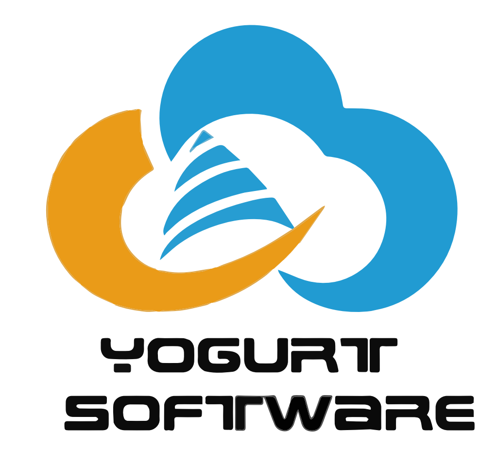

# MTMS Backend

<div align="center">
	
</div>

Marker & Tutor Management System - One COMPSCI399 Project

The University of Auckland

---
## Our Website

https://uoamtms.com/

## Our Project Management Page
https://yogurtsoftware.notion.site/Home-54f80f6bef7a474d93e1f61a590d5ced

## Tech Stack
* Python 3 ---- Programming Language
* Flask ---- Framework
* Flask Restful ---- API Helper
* Flask Caching ---- File System Cache
* Flask Httpauth ---- Authentication & Authorization
* Celery ---- Task queues
* SQLAlchemy ---- ORM Engine
* Alembic ---- Database Migration Tool
* Flasgger ---- OpenAPI Generator
* Sentry ---- Backend server Anomaly Detection
* Flask APScheduler ---- task timer
* Pandas ---- Process CSV, XSL, XSLX Course Template

## Setup Development Environment
### Installation

**Installation via requirements.txt**

#### Linux
```shell
$ virtualenv venv
$ source ./venv/bin/activate
$ pip install -r requirements.txt
```
#### MacOS
```shell
$ virtualenv venv
$ source ./venv/bin/activate
$ pip install -r requirements.txt
```
#### Windows Powershell
```shell
$ virtualenv venv
$ .\\venv\Scripts\activate
$ pip install -r requirements.txt
```

When using PyCharm for requirements installation, set the virtual environment using 'File'->'Settings' and select your project from the left menu. Select 'Project Interpreter', click on the gearwheel button and select 'Add'. Click the 'Existing environment' radio button to select the virtual environment. 

### Start Dev Server
```shell
$ flask run
```

### Default Admin User
You can use the admin account to access all modules of the system
```plain
username: admin
password: admin
```


## API Documentation
We use swagger as the API documentation, you can log in to http://127.0.0.1:5000/apidocs/ to view after running the development server.


## Database Migration
Official documentation: https://alembic.sqlalchemy.org/en/latest/
* set migration
```shell
alembic revision --autogenerate -m "Your Commit Text" 
```
* upgrade database
```shell
alembic upgrade head
```
* downgrade database
```shell
alembic downgrade head
```


## Config SMTP Server
You need to run the server first, it will automatically create a .env file in the project root directory. You can edit the .env file to set the SMTP server.
You can find the following configuration items in .env, enter your smtp server related information, and restart the server.
```plain
EMAIL_ACCOUNT=''
EMAIL_PASSWORD=''
EMAIL_SENDER_ADDRESS=''
EMAIL_SERVER_HOST=''
EMAIL_SERVER_PORT=587
EMAIL_SERVER_SSL_PORT=465
EMAIL_SENDER_NAME=""
```

## Config Celery
Celery is an asynchronous task queue, which has better performance as an alternative to email sending in this system. It is highly recommended that you configure celery.
For more information, please go in to https://docs.celeryq.dev/en/stable/getting-started/introduction.html

You need to run the server first, it will automatically create a .env file in the project root directory. You can edit the .env file to set Celery.
You can find the following configuration items in .env, enter your Celery Broker URL, and restart the server.

You first need to install a suitable cache database (Redis, RabbitMQ, ...) on your computer
```plain
CELERY_RESULT_ENGINE_OPTIONS  =  {'echo': True}
CELERY_BROKER_URL=''
CELERY_RESULT_BACKEND=''
```

You also need to open another terminal (note that the terminal path is also in the project root directory) and enter the following command to start.
* Windows
```shell
celery -A celery_worker.celery  worker -l info -P gevent
```


## Config Sentry
Sentry is Application Monitoring and Error Tracking Software.
Official documentation: https://docs.sentry.io/platforms/python/flask/

You need to run the server first, it will automatically create a .env file in the project root directory. You can edit the .env file to set the Sentry.
You can find the following configuration items in .env, enter your Sentry DSN, and restart the server.
```plain
SENTRY_DSN=''
```


## Config uWSGI
uWSGI is a fast, self-healing, developer-friendly WSGI server for Python applications. It is used to deploy the application to the production environment.

We have created the uWSGI configuration file, `mtms.ini` in the project root directory.

If you wish to deploy on **Linux** you can use uWSGI. Official documentation: https://uwsgi-docs.readthedocs.io/en/latest/

For detailed deployment tutorials, please check: https://www.digitalocean.com/community/tutorials/how-to-serve-flask-applications-with-uswgi-and-nginx-on-ubuntu-18-04


## Config Database
Our project uses sqlite as the database by default, and sqlite is automatically created when the server is started for the first time. If you wish to deploy this project on a server, we strongly recommend that you use MySQL.
You need to run the server first, it will automatically create a .env file in the project root directory. You can edit the .env file to set the database. You can find the following configuration items in .env, enter your database URL, and restart the server.
```plain
SQLALCHEMY_DATABASE_URI = 'sqlite:///MTMS.db'  
```


## Future Work
1. **Automatically assigning function** 

    Automatically assigning function is not part of our project, but it can significantly reduce the tutor/marker coordinator's workload. So we will implement this feature in our future work. While the Hungarian algorithm (https://en.wikipedia.org/wiki/Hungarian_algorithm) can solve this feature after modification.The problem is similar to “n agents, m tasks” assignment problem in combinatorics, except that in our case one marker can mark many courses, and one course can have many markers.According to the students on a course of suitability and preferences, it will automatically match work course and time.
    
2. **Payment Day Email Reminder** 

    In the future, we will add automatic email reminders system for tutors and markers so that they can submit their workload before payday. The coordinator can set the number of paydays and dates, as well as how many days to send the email in advance.

3. **In-site Messaging System** 

    For a recruitment and administration site, the presence of a messaging system within the site is the icing on the cake, which allows for more accessible communication between students and coordinators. It dramatically simplifies the recruitment steps. In addition, we can also connect it to the email reminder system so that when users are not online, they can receive the reminder email.

## Acknowledgement
1. Many thanks to our Clients: Burkhard and Sudeep,Coordinator: Asma,Tutor: Anshul for all the assistance, feedback and suggestions they have given us throughout the project.
2. **Database Migration**
 https://alembic.sqlalchemy.org/en/latest/
3. **Config Celery**
https://docs.celeryq.dev/en/stable/getting-started/introduction.html
4. **Config Sentry**
https://docs.sentry.io/platforms/python/flask/
5. **Config uWSGI**
https://uwsgi-docs.readthedocs.io/en/latest/
https://www.digitalocean.com/community/tutorials/how-to-serve-flask-applications-with-uswgi-and-nginx-on-ubuntu-18-04
6. **Config Database**
https://www.sqlalchemy.org/
7. Compsci235
The flask knowledge taught served as the cornerstone of the back end of our project.
8. Compsci340
The knowledge of threads and processes taught provides support for projects to solve resource seizure problems.